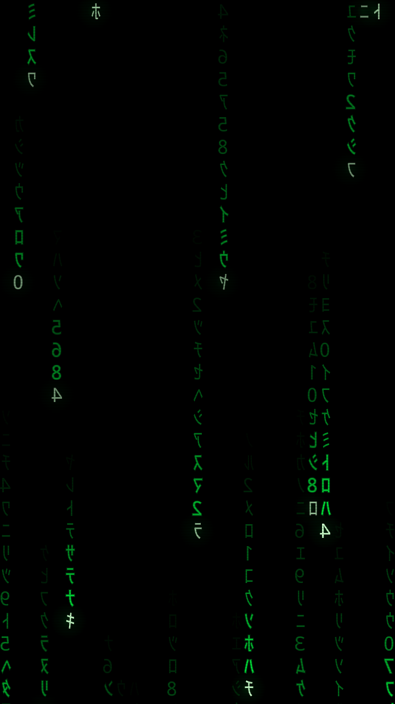
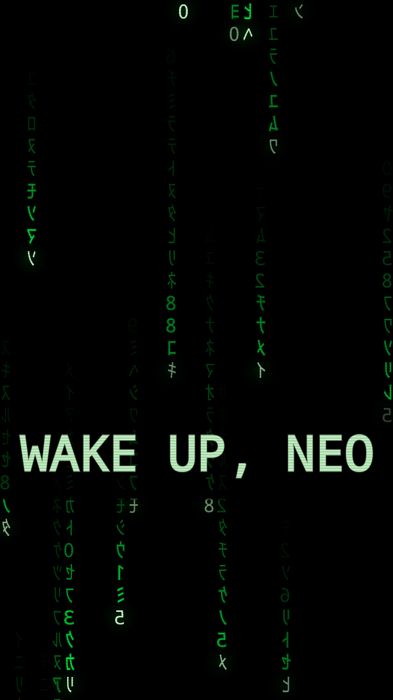
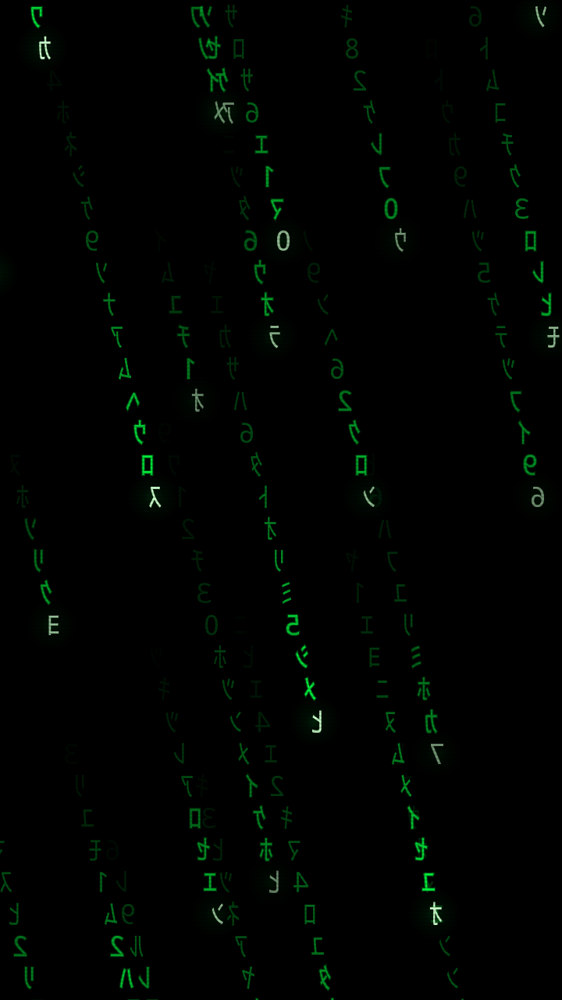
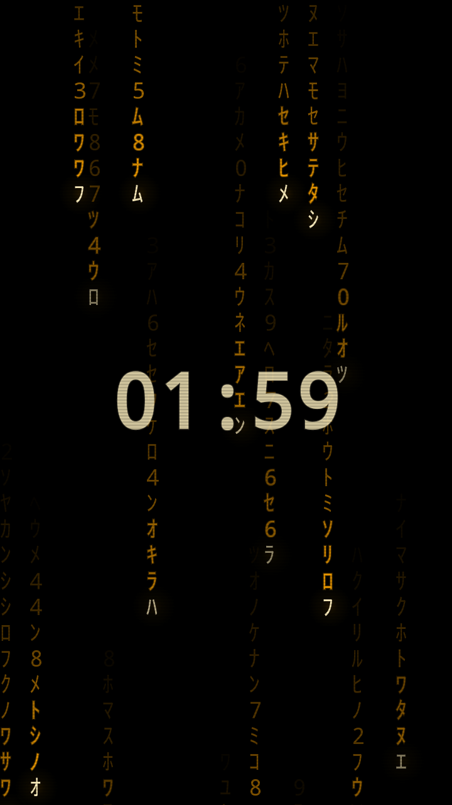
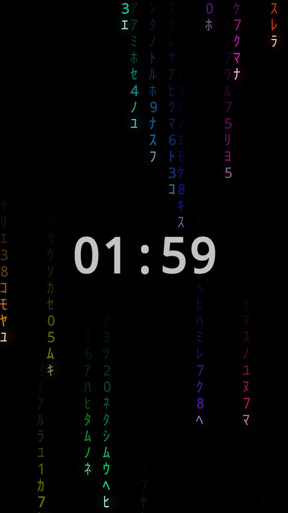

# Codefall

A falling-code screensaver, daydream and live wallpaper for Android, with live
controls for colour, speed, density and a pile of other knobs.

No permissions, no network access, no ads, no trackers.

<p align="center">
  
  
  
</p>
<p align="center">
  
  
</p>

## Install

Grab **`dist/Codefall.apk`** from this repo, copy it to your phone and tap it.

`dist/` keeps every released build. `Codefall.apk` is always a copy of the
latest. The two earlier releases are still there under their original name —
`MatrixCode-v1.0.apk` and `MatrixCode-v1.1.apk` — and the `v1.0` branch holds
the source as it stood at that release.

Codefall uses a different package name from those builds, so it installs
**alongside** them rather than replacing them.

Android will ask you to allow installing from unknown sources the first time —
that's expected for an APK that didn't come from the Play Store. Or install over
USB:

```
adb install -r dist/Codefall.apk
```

The APK is signed with the standard Android debug key, so it installs on any
device without further setup. Minimum Android 5.0 (API 21).

## Using it

Open **Codefall**. The top of the screen is a live preview — every control
updates it instantly, so you can dial in the look before committing.

`▶ START SCREENSAVER` takes it fullscreen (immersive, no status bar). Tap
anywhere or press back to come out.

There are two other ways to run it:

- **SET AS SYSTEM SCREENSAVER** registers it as an Android *daydream*, so the
  system starts it on its own while the device is docked or charging. The button
  opens the right settings page; pick "Codefall Rain" there.
- **SET AS LIVE WALLPAPER** puts the rain behind your home screen. It runs at
  40fps instead of 60 to stay easy on the battery, and picks up settings changes
  the moment you make them.

## Options

**Appearance**

| Option | Range | What it does |
| --- | --- | --- |
| Color | 8 themes | Classic Green, Amber CRT, Ice Cyan, Red Pill, Neon Violet, Gold, Ghost White, Rainbow (hue sweeps across the columns and drifts over time) |
| Character set | 6 sets | Katakana, Binary, Hexadecimal, ASCII, Symbols, Mixed |
| Glyph size | 10–36 dp | Bigger glyphs mean fewer, wider columns |
| Column density | 20–100% | How many columns are raining at once |
| Mirror glyphs | on/off | Flips the glyphs, the way the film's code was shot |

**Motion**

| Option | Range | What it does |
| --- | --- | --- |
| Fall speed | 0.1x–4.0x | Multiplier on the fall rate |
| Trail length | 0.2x–2.0x | How far the fading tail stretches behind each head |
| Glyph churn | 0–100% | How often glyphs mutate in place while falling |
| Settle trail | on/off | Concentrates the churn near the bright head, so glyphs freeze as they fade |
| Tilt steers the rain | on/off | The rain leans toward whichever edge you tip down |
| Tilt strength | 0–2.0x | How hard tilt pulls, capped at about a 17° slant |

**Secret message**

Type any text and the rain periodically resolves into it — it fades in over the
falling code, holds for a couple of seconds, then dissolves back. Blank disables
it. The reveal interval is adjustable from 5 to 120 seconds. The message is
drawn after the mirror flip is undone, so it always reads forwards.

**Effects**

| Option | Range | What it does |
| --- | --- | --- |
| Glow | 0–100% | Bloom halo around the leading glyph |
| CRT scanlines | 0–100% | Horizontal scanline overlay |
| Glitch | 0–100% | Chance of a column blinking out for a beat |

**Screensaver**

Show clock (with a 12/24-hour toggle) and keep-screen-awake.

`RANDOMIZE` rolls every visual setting at once — good for finding looks you
wouldn't have dialled in by hand. `RESET` returns the visuals to defaults but
leaves your clock, screen-awake and message preferences alone. `CLASSIC`
restores the original v1.0 look, turning off mirroring, trail settling and tilt
in one tap.

Settings are saved as you change them and shared by all three modes.

## How it works

`RainRenderer` owns the whole simulation and knows nothing about Android's
view or service plumbing, which is why the fullscreen activity, the daydream,
the live wallpaper and the settings preview can all share one engine.

Each column tracks a fractional head position, its own fall speed, a trail
length and a depth plane. Columns are assigned one of three depths; far ones are
slower and dimmer, which reads as parallax. Rather than fading the whole frame
with a translucent black rect (the usual trick, which smears), every glyph in a
trail is drawn explicitly with its own alpha — that keeps the trail crisp and
makes trail length a real, controllable parameter.

Mirroring flips the entire rain layer with a single canvas transform rather than
flipping each glyph, which costs one `save`/`restore` per frame instead of a
thousand. Because that also reverses apparent motion, the tilt lean is negated
under the mirror so the rain still falls toward the edge you tipped down. The
clock and the message are drawn after the flip is undone, so they read forwards.

Tilt uses the gravity sensor, rotated into screen space and registered only
while the rain is actually on screen. The lean is capped regardless of the
strength setting: uncapped, a full tilt sheared each trail by more than a cell
per row and smeared the streaks across the whole screen. Drift and slant share
one coefficient, since a trail marks where its own head has been — if the two
disagree, the streak detaches from its head.

`RenderLoop` is a plain render thread that drives the renderer onto a
`SurfaceHolder`, using `lockHardwareCanvas` where available.

## Building

Needs JDK 17+ and the Android SDK (platform 36, build-tools 36.1.0).

```
export ANDROID_HOME=/path/to/android-sdk
./gradlew testDebugUnitTest   # renderer + UI tests
./gradlew assembleRelease     # -> app/build/outputs/apk/release/
./gradlew bundleRelease       # -> app/build/outputs/bundle/release/ (Play upload)
```

Release builds are signed from `keystore.properties`, which is not in version
control. Copy `keystore.properties.sample` to `keystore.properties` and point it
at your upload keystore; without it the release build is left unsigned rather
than silently falling back to a debug key.

## Publishing

`store/` holds everything the Play Console asks for — listing copy, the data
safety and content rating answers, the 512x512 icon, the feature graphic and
five phone screenshots. See `store/LISTING.md`. The screenshots are rendered
from the real renderer by:

```
./gradlew :app:testDebugUnitTest --tests '*StoreAssetsTest*'
python3 tools/store_assets.py
```

The privacy policy is in `PRIVACY.md` and needs hosting at a public URL before
Play will accept the listing.

The tests render real frames off-device through Robolectric's native graphics
mode and check them for blank output, rain reaching the full height, the right
colour dominating per theme, the message reveal firing and clearing, and churn
concentrating at the head when the trail is set to settle. Frames are written to
`app/build/frames/` so you can eyeball changes to the look without deploying to
a phone.

The tilt tests measure the lean by subclassing `Canvas` and recording where each
glyph is asked to be drawn, against a field frozen at zero speed. Measuring it
from pixels instead gives a badly biased answer: glyphs sheared past the screen
edge are clipped away, and losing exactly the most-shifted glyphs cancels out
the shift being measured.
